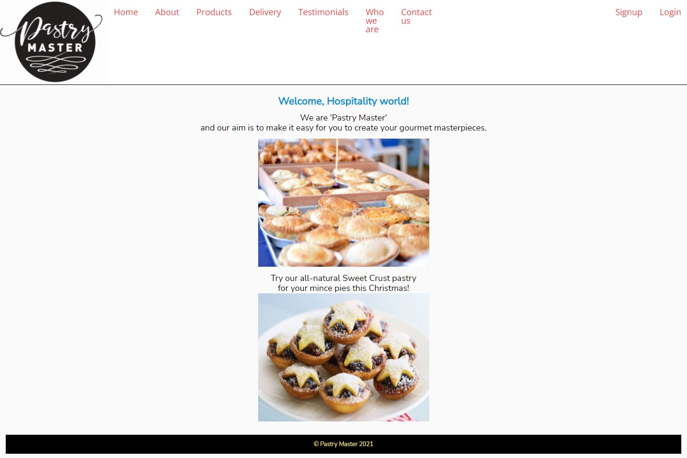

# jubilant-programmer
Business website for a small Melbourne-based food manufacturer 'Pastry Master' built with MERN technologies.

[](https://opensource.org/licenses/MIT)


## Description
Inaugural website for the small Melbourne-based food manufacturer 'Pastry Master' comprising pages for:
* Product range
* Delivery and Distribution method
* Testimonials from existing customers
* Who we are
* Contact us

Ideally, the website will also have the ability to:
* Accept online orders and payments
* Store data of users/customers and their enquiries and orders onto a database
    
## Motivation
Developing a website for the ‘Pastry Master’ business my husband and I own was the whole motivation for signing up to do the Bootcamp Coding course!
    
## Problem
Previously, the business did not have an online prescence which was causing us to miss sales opportunities and was damaging our professional credibility.

## User Story
```md
AS AN Owner/Marketing Manager of a small food manufacturing business selling pastry to other small businesses, 
I WANT a website that presents our brand in a positive & professional way,
SO THAT new & existing customers can see our product range & make contact with us digitally & we can build a database of customers.
```

## Screenshot
.
    
## Installation
* npm start - to install node modules
* npm run seed - to seed the database
* npm run dev - to run the website on a local host

Once deployed on Heroku, a user needs only to open the following link to open the website:
    https://rachel-project-3.herokuapp.com/
    
## Usage
On opening the wesite, the user will be presented with a home page with a login/signup option to be allowed access to the full website.  There is a Contact page with a series of questions for the user allowing him/her to submit enquiries to the business which will be converted into an e-mail format.  In the back end, this information will be added to the Customer database.

## Technologiues Used 
* Wireframes for concept development
* MERN stack – MongoDB/Express.js/React/Node.js
* Heroku for deployment
* GitHub
* Styled-components
* MUI components
* Stripe
* Nodemailer

## Future Upgrades
The development of this website will be ongoing in order to continue to improve and to be dynamic, offering additional information for our customers over time.  Future upgrades will continue:
* Debugging Nodemailer 
* Adding professional photos
* Redesigning for a better look & feel
* Requesting input from customers & Marketeers for improvements in functionality
* Automating some processes such as email communication
* Activating Stripe for online sales
* Connecting to existing Xero accounting software

## Status
In development

## URLs
* The URL of the deployed application:  https://rachel-project-3.herokuapp.com/
* The URL of the GitHub repository:     https://github.com/rachel-brain/jubilant-programmer

## Contact
* Mobile: +61 432 297 755
* Email: rachel.brain@internode.on.net
* LinkedIn: https://www.linkedin.com/in/rachel-brain-89570930
* GitHub: https://github.com/rachel-brain